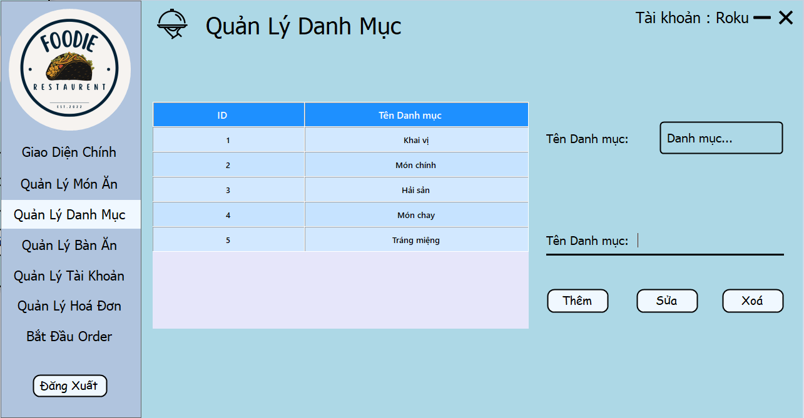

  

# Phần mềm Quản lý Nhà Hàng

## Giới thiệu

-   Đây là ứng dụng được sử dụng làm đồ án cuối kì cho môn Nhập môn Công nghệ phần mềm.
-   Ứng dụng được xây dựng theo mô hình ..., cài đặt giao diện bằng C# Winforms.

### Giảng viên hướng dẫn

-   ...

### Sinh viên thực hiện

| **STT** | **MSSV**  | **Họ và tên**     | **Email**                   |
| ------- | --------- | ----------------- | --------------------------- |
| 1       | 121001332 | Lê Văn Tuấn       | vantuancutevaytaz@gmail.com |
| 2       | 121001491 | Lê Tấn Phát       | phatle13103110@gmail.com    |
| 3       | 121001126 | Nguyễn Thiện Nhân | nicktolonguyen@gmail.com    |
| 4       | 121001113 | Nguyễn Minh Quân  | minkuan1704@gmail.com       |
| 5       | 121001198 | Trần Hữu Lộc      | tranhuuloc4423@gmail.com    |

## Chạy thử project

### Yêu cầu để thực thi project

-   Visual Studio 2022
-   .NET Framework 4.7.
-   SQL Server
-   Bunifu UI/UX Framework

### Bước 1: Khởi tạo database

-   Thực thi file QLNH.sql và QLNH_Scripts.sql để khởi tạo database

### Bước 2: Thực thi chương trình

-   Mở solution trong Visual Studio
-   Tải về bằng Nuget nếu VS không tự động tải: Bunifu UI/UX Framework
-   Debug

## Demo ứng dụng

### Form Đăng Nhập (Login)

### Form Giao Diện Chính (Dashboard)

### Form Quản Lý Món Ăn (FoodManage)

### Form Quản Lý Danh Mục Món Ăn (CateManage)

### Form Quản Lý Bàn Ăn (tableManage)

### Form Quản Lý Tài Khoản (accountManage)

### Form Quản Lý Hoá Đơn (billManage)

### Form Đặt Món Ăn (Order)

## Release

-   Chương trình đã có bản release. Có thể download file installer về cài đặt và dùng thử
